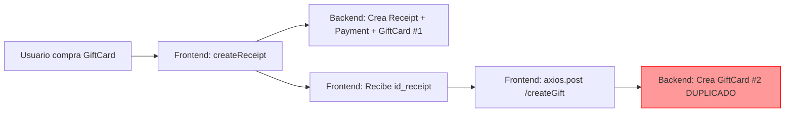
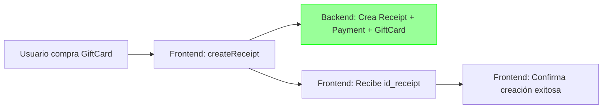

# 🔍 ANÁLISIS COMPLETO - DUPLICACIÓN DE GIFTCARDS (FRONTEND)

## 📊 RESUMEN EJECUTIVO

### 🚨 **PROBLEMA PRINCIPAL IDENTIFICADO**

**GiftCard.jsx está creando 2 GiftCards por cada compra:**

1. **Primera creación**: `createReceipt()` → Backend crea GiftCard #1
2. **Segunda creación**: `axios.post('/giftcard/createGift')` → Crea GiftCard #2

**Resultado:** Duplicación del monto y 2 registros en la base de datos

---

## 🔍 ANÁLISIS DETALLADO POR COMPONENTE

### **1. ❌ GiftCard.jsx - DUPLICACIÓN CRÍTICA** (CORREGIDO ✅)

**📍 Ubicación:** `BonitaFront/src/Components/GiftCard.jsx` líneas 248-258

#### **Problema Original:**
```javascript
// ❌ CÓDIGO INCORRECTO (ANTES)
const receiptResponse = await dispatch(createReceipt(receiptData)); // Crea GiftCard #1
setIsSubmitted(true);

const createdReceipt = receiptResponse?.payload?.receipt || receiptResponse?.receipt;
const id_receipt = createdReceipt?.id_receipt;

if (id_receipt) {
  await axios.post(`${BASE_URL}/giftcard/createGift`, {  // ❌ Crea GiftCard #2 (DUPLICADO)
    buyer_email: buyerEmail,
    saldo: Number(amount),
    id_receipt: id_receipt,
  });
}
```

#### **Solución Aplicada:**
```javascript
// ✅ CÓDIGO CORREGIDO (DESPUÉS)
const receiptResponse = await dispatch(createReceipt(receiptData)); // Crea GiftCard automáticamente
setIsSubmitted(true);

const createdReceipt = receiptResponse?.payload?.receipt || receiptResponse?.receipt;
const id_receipt = createdReceipt?.id_receipt;

// ✅ CORREGIDO: createReceipt YA crea la GiftCard en el backend
// NO es necesario llamar a /giftcard/createGift nuevamente
// La GiftCard se crea automáticamente en createReceipt.js líneas 114-128

if (!id_receipt) {
  throw new Error("No se pudo obtener el id del recibo.");
}

console.log("✅ GiftCard creada automáticamente por createReceipt:", {
  id_receipt,
  buyer_email: buyerEmail,
  saldo: Number(amount)
});
```

#### **¿Por qué estaba duplicando?**

1. **Backend:** `createReceipt.js` líneas 114-128
   ```javascript
   if (payMethod === "GiftCard" && !id_orderDetail) {
     // ... crear Receipt
     // ... crear Payment
     await GiftCard.create({ // ← GIFTCARD #1
       buyer_email,
       saldo: amount,
       id_receipt: receipt.id_receipt
     });
   }
   ```

2. **Frontend:** `GiftCard.jsx` línea 254
   ```javascript
   await axios.post('/giftcard/createGift', { // ← GIFTCARD #2 (DUPLICADO)
     buyer_email: buyerEmail,
     saldo: Number(amount),
     id_receipt: id_receipt,
   });
   ```

**✅ ESTADO:** CORREGIDO - Eliminada la segunda llamada

---

### **2. ✅ RedeemGiftCard.jsx - Protección Mejorada**

**📍 Ubicación:** `BonitaFront/src/Components/RedeemGiftCard.jsx`

#### **Problema:**
- No tenía estado de loading
- Botón no se deshabilitaba durante el procesamiento
- Permitía múltiples clics rápidos

#### **Solución Aplicada:**

1. **Agregado estado `isRedeeming`:**
   ```javascript
   const [isRedeeming, setIsRedeeming] = useState(false);
   ```

2. **Protección en `handleConfirmRedemption`:**
   ```javascript
   const handleConfirmRedemption = async () => {
     // ✅ Prevenir doble submit
     if (isRedeeming) {
       console.log("⚠️ Ya se está procesando un canje");
       return;
     }

     try {
       setIsRedeeming(true); // ✅ Activar loading
       
       // Mostrar SweetAlert loading
       Swal.fire({
         title: "Procesando canje...",
         allowOutsideClick: false,
         showConfirmButton: false,
         willOpen: () => Swal.showLoading()
       });

       // ... proceso de canje ...
     } finally {
       setIsRedeeming(false); // ✅ Desactivar siempre
     }
   };
   ```

3. **Botón deshabilitado durante proceso:**
   ```javascript
   <button
     onClick={handleConfirmRedemption}
     disabled={selectedProducts.length === 0 || remainingBalance < 0 || isRedeeming}
   >
     {isRedeeming ? "Procesando..." : "Confirmar Canje"}
   </button>
   ```

**✅ ESTADO:** CORREGIDO

---

### **3. ✅ ReturnManagment.jsx - Ya tenía protección**

**📍 Ubicación:** `BonitaFront/src/Components/stock/ReturnManagment.jsx`

#### **Estado:**
```javascript
<button
  onClick={handleProcessReturnWithDifference}
  disabled={loading || returnData.returned_products.length === 0} // ✅ Ya protegido
>
  {loading ? "Procesando..." : "✅ Procesar Devolución"}
</button>
```

**✅ ESTADO:** YA CORRECTO - No requiere cambios

---

### **4. ✅ ActiveGiftCards.jsx - Funcionando Correctamente**

**📍 Ubicación:** `BonitaFront/src/Components/ActiveGiftCards.jsx`

#### **Funcionalidad:**
- Obtiene lista de usuarios con GiftCards activas
- Consulta el saldo real de cada una
- Filtra solo las que tienen saldo > 0
- Muestra botón "Usar Saldo"

#### **Flujo:**
```javascript
// 1. Obtener usuarios con GiftCards
const response = await axios.get('/caja/active-giftcards');

// 2. Para cada usuario, obtener saldo REAL
const cardsWithRealBalance = await Promise.all(
  initialCards.map(async (card) => {
    const balanceRes = await axios.get(`/giftcard/balance/${card.email}`);
    return {
      ...card,
      originalBalance: card.balance, // Monto original
      balance: balanceRes.data.saldo || 0 // Saldo real disponible
    };
  })
);

// 3. Filtrar solo con saldo > 0
const cardsWithBalance = cardsWithRealBalance.filter(card => card.balance > 0);
```

**✅ ESTADO:** FUNCIONANDO CORRECTAMENTE

---

## 📋 COMPARACIÓN: ANTES vs DESPUÉS

### **ANTES (Con duplicación):**



**Resultado:** 2 GiftCards con el mismo `id_receipt` y monto duplicado

---

### **DESPUÉS (Corregido):**



**Resultado:** 1 GiftCard correcta

---

## 🎯 CHECKLIST DE CAMBIOS APLICADOS

### Backend (Ya aplicados anteriormente):
- [x] Validación de duplicados en `returnProducts.js`
- [x] Validación de duplicados en `createReceipt.js`
- [x] Validación de duplicados en `createGiftCard.js`
- [x] Migración de índices únicos
- [x] Script de limpieza de duplicados

### Frontend (Aplicados ahora):
- [x] **GiftCard.jsx**: Eliminada segunda llamada a `/createGift`
- [x] **RedeemGiftCard.jsx**: Agregado estado `isRedeeming`
- [x] **RedeemGiftCard.jsx**: Botón deshabilitado durante proceso
- [x] **RedeemGiftCard.jsx**: Loading visual con SweetAlert
- [x] **ReturnManagment.jsx**: Verificado - ya tenía protección

---

## 🧪 PRUEBAS RECOMENDADAS

### **1. Prueba de Compra de GiftCard**

```bash
# 1. Abrir Chrome DevTools → Network tab
# 2. Ir a /giftcard/create/:documento
# 3. Comprar una GiftCard de $100,000
# 4. Verificar en Network:
#    - Solo debe haber 1 llamada a /caja/receipt
#    - NO debe haber llamada a /giftcard/createGift
# 5. Verificar en base de datos:
SELECT * FROM "GiftCards" WHERE id_receipt = [ÚLTIMO_RECIBO];
#    - Debe haber solo 1 registro
```

### **2. Prueba de Devolución con Crédito**

```bash
# 1. Hacer una devolución donde el cliente recibe crédito
# 2. Verificar en base de datos:
SELECT * FROM "GiftCards" 
WHERE reference_id = '[ID_RECIBO_ORIGINAL]' 
AND reference_type = 'RETURN_CREDIT';
#    - Debe haber solo 1 registro
# 3. Intentar devolver el mismo recibo otra vez
#    - Debe prevenir duplicado
```

### **3. Prueba de Doble Clic**

```bash
# 1. En /giftcard/redeem/:documento
# 2. Seleccionar productos
# 3. Hacer clic RÁPIDO 2 veces en "Confirmar Canje"
# 4. Verificar:
#    - Solo debe procesarse 1 vez
#    - Botón debe deshabilitarse inmediatamente
#    - Debe mostrar "Procesando..."
```

---

## 📊 MONITOREO POST-IMPLEMENTACIÓN

### **Queries útiles para verificar:**

```sql
-- 1. Verificar duplicados por id_receipt
SELECT 
  id_receipt, 
  COUNT(*) as cantidad,
  STRING_AGG(CAST(id_giftcard AS TEXT), ', ') as ids,
  SUM(saldo) as total_saldo
FROM "GiftCards"
WHERE id_receipt IS NOT NULL
GROUP BY id_receipt
HAVING COUNT(*) > 1;

-- 2. Verificar duplicados por reference (devoluciones)
SELECT 
  reference_id,
  reference_type,
  COUNT(*) as cantidad,
  STRING_AGG(CAST(id_giftcard AS TEXT), ', ') as ids,
  SUM(saldo) as total_saldo
FROM "GiftCards"
WHERE reference_id IS NOT NULL
GROUP BY reference_id, reference_type
HAVING COUNT(*) > 1;

-- 3. Ver últimas GiftCards creadas (para monitoreo)
SELECT 
  id_giftcard,
  buyer_email,
  saldo,
  payment_method,
  reference_type,
  id_receipt,
  "createdAt"
FROM "GiftCards"
ORDER BY "createdAt" DESC
LIMIT 20;
```

---

## ⚠️ CONSIDERACIONES ADICIONALES

### **1. Cache del Navegador**
Si los usuarios ya tienen la app cargada:
```bash
# Limpiar cache:
- Ctrl + Shift + R (hard reload)
- O incrementar version en package.json
```

### **2. Rollback Plan**
Si hay problemas, revertir cambios:
```bash
# Frontend
git checkout HEAD~1 src/Components/GiftCard.jsx
git checkout HEAD~1 src/Components/RedeemGiftCard.jsx

# Backend
node scripts/run-migrations.js down 008
```

### **3. Comunicación al Equipo**
```
📢 IMPORTANTE: Actualización de GiftCards

✅ Corregido: Duplicación de GiftCards al comprar
✅ Mejorado: Protección contra doble clic en canjes
⚠️ Acción requerida: 
   1. Hacer hard reload (Ctrl+Shift+R)
   2. Reportar cualquier comportamiento extraño
   
🔗 Documentación: SOLUCION_DUPLICACION_GIFTCARDS.md
```

---

## 📞 SOPORTE

### **Si después de implementar sigues viendo duplicados:**

1. **Verificar versión del código:**
   ```bash
   git log --oneline -5
   ```

2. **Revisar logs del servidor:**
   ```bash
   tail -f logs/app.log | grep GiftCard
   ```

3. **Activar logging detallado:**
   ```javascript
   // En createReceipt.js, agregar temporalmente:
   console.log("🔍 DEBUG createReceipt - payMethod:", payMethod);
   console.log("🔍 DEBUG createReceipt - id_orderDetail:", id_orderDetail);
   ```

4. **Revisar Network tab en Chrome:**
   - Verificar qué endpoints se están llamando
   - Cuántas veces se llama cada uno
   - Qué respuestas están retornando

---

## ✅ CONCLUSIÓN

### **Problema Principal:**
La duplicación se debía a que `GiftCard.jsx` llamaba:
1. `createReceipt()` → creaba GiftCard en backend
2. `/giftcard/createGift` → creaba segunda GiftCard

### **Solución:**
Eliminada la segunda llamada, ya que `createReceipt()` maneja todo el proceso.

### **Protecciones Adicionales:**
- Backend valida duplicados antes de crear
- Índices únicos en base de datos previenen duplicados
- Frontend tiene estados de loading en todos los flujos
- Botones se deshabilitan durante procesamiento

### **Estado Final:**
✅ **PROBLEMA RESUELTO** - GiftCards ahora se crean correctamente una sola vez

---

**Fecha de implementación:** {{ fecha }}  
**Archivos modificados:**
- `BonitaFront/src/Components/GiftCard.jsx`
- `BonitaFront/src/Components/RedeemGiftCard.jsx`
- `BonitaBack/src/controller/Products/returnProducts.js`
- `BonitaBack/src/controller/Caja/createReceipt.js`
- `BonitaBack/src/controller/Caja/createGiftCard.js`
